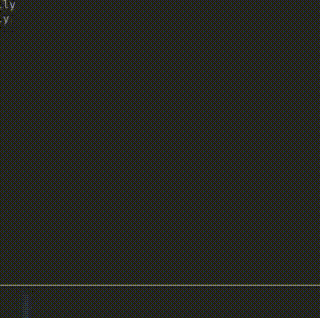

# Traffic Simulation Project

This project is a traffic simulation implemented in C using the **SDL2 library**. It simulates a four-way intersection with vehicles moving in different directions, traffic lights, and collision detection. The simulation is visualized using SDL2's rendering capabilities, providing a real-time view of traffic flow and vehicle interactions.

---

## Table of Contents
1. [Installation](#installation)
2. [Dependencies](#dependencies)
3. [Usage](#usage)
4. [Project Structure](#project-structure)
5. [Key Features](#key-features)
6. [References for SDL2](#references-for-sdl2)
7. [Demo](#demo)

---

## Installation

### Prerequisites
Before running the simulation, ensure you have the following installed:
- A C compiler (e.g., `gcc` or `clang`)
- SDL2 library
- SDL2 development headers
- CMake (for building the project)

### Steps to Install and Run

1. **Install SDL2**:
   - On **Arch Linux**:
     ```bash
     sudo pacman -S cmake sdl2
     ```
   - On **Windows**:
     - Download the SDL2 development libraries from the [official SDL2 website](https://www.libsdl.org/download-2.0.php).
     - Follow the installation instructions provided.

2. **Clone the Repository**:
   ```bash
   git clone https://github.com/razzat008/dsa-queue-simulator
   cd dsa-queue-simulator
   ```

3. **Build the Project**:
   ```bash
   cd generator
   cmake -S . -B build/
   cd build && make
   ```

4. **Run the Simulation**:
   - To run the simulation:
     ```bash
     ./simulator
     ```
   - To run the traffic generator:
     ```bash
     ./generator
     ```

---

## Dependencies

- **SDL2**: Used for rendering the simulation and handling window management.
- **Standard C Libraries**: Used for basic I/O, memory management, and data structures.
- **CMake**: Used for building the project.

---

## Usage

The simulation runs in a window and displays vehicles moving through a four-way intersection. Traffic lights control the flow of vehicles, and collision detection ensures vehicles do not overlap.

### Controls
- **Close the Window**: Click the close button or press `ESC` to exit the simulation.
- **Traffic Light Timing**: Traffic lights switch automatically every **8.555 seconds**.

---

## Project Structure

The project is organized as follows:
```
dsa-queue-simulator/
├── generator/
│   ├── generator.c       # Program for generating traffic by choosing a random lane
│   ├── CMakeLists.txt    # CMake configuration for the generator
├── simulator/
│   ├── simulator.c       # Main simulation program
│   ├── CMakeLists.txt    # CMake configuration for the simulator
├── README.md             # Project documentation
├── simulation.gif        # Demo GIF of the simulation
```

### Key Files
- **`generator.c`**: Generates traffic by randomly assigning vehicles to lanes.
- **`simulator.c`**: Simulates the traffic flow, including vehicle movement, traffic lights, and collision detection.
- **`CMakeLists.txt`**: Configuration files for building the project using CMake.

---

## Key Features

### 1. **Vehicle Management**
   - Vehicles are represented by the `Vehicle` struct, which includes properties such as position, speed, and target lane.
   - A `VehicleQueue` is used to manage vehicles waiting to enter the simulation, ensuring efficient enqueue and dequeue operations.

### 2. **Traffic Light Management**
   - Traffic lights are controlled by the `updateTrafficLights` function.
   - Lights switch between green and red states at regular intervals, simulating real-world traffic light behavior.

### 3. **Rendering**
   - SDL2 is used to render vehicles, roads, and traffic lights.
   - The `DrawBackground` function draws the roads and lane markings.
   - The `drawVehicle` function renders each vehicle on the screen.

### 4. **Vehicles Stopping**
   - Vehicles stop  if the traffic light is red.

### 5. **Lane Prioritization**
   - Vehicles are prioritized based on traffic light states and lane rules.
   - Vehicles in non-priority lanes stop when the traffic light is red.

---

## References for SDL2

- **Official SDL2 Documentation**: [https://wiki.libsdl.org/](https://wiki.libsdl.org/)
- **SDL2 Tutorials**: [Lazy Foo' SDL Tutorials](https://lazyfoo.net/tutorials/SDL/)
- **SDL2 GitHub Repository**: [https://github.com/libsdl-org/SDL](https://github.com/libsdl-org/SDL)

---

## Demo

Below is a demo of the traffic simulation in action:



---

## Contributing

Contributions are welcome! If you'd like to contribute to this project, please follow these steps:
1. Fork the repository.
2. Create a new branch for your feature or bugfix.
3. Commit your changes and push them to your fork.
4. Submit a pull request with a detailed description of your changes.

---

## Needs Improvement On
1. Collision detection
2. Error handling
3. Dynamic Vehicle properties

---

## License

This project is licensed under the MIT License. See the [LICENSE](LICENSE) file for details.
